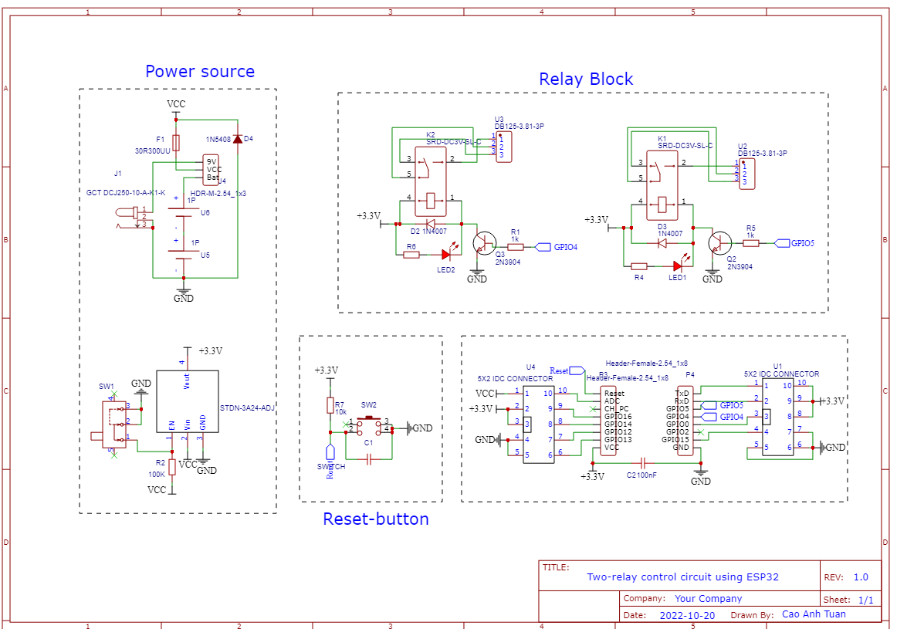

# Smart-home-based-on-IoT-Technology
"I made this project for my final thesis, which is about building an IoT system for a regular home."
## 1. Sumary
My thesis topic is smart home based on IoT technology. With the goal of making home more intelligent with the application of IoT technology, I have developed a full IoT system that connects relay , RFID readers, physical buttons, temperature-humidity sensors, hazardous gas concentration sensors together and connect them to the internet or let's say connect them to a realtime cloud based database provided by Google called 
Firebase Realtime Databse. In addition, the system also has an android application that 
will control the above-mentioned devices through this database.

## 2. Hardware
### 2.1. Component list
 - ESP12F 
 - ESP32
 - RFID reader(RC522)
 - Relay
 - DC-DC conveter (STDN-3A24-ADJ)
 - MQ2 Gas Sensor
 - DHT11 Sensor
### 2.2. Hardware design

 

System plan

I decided to use wireless mesh network(WMN) to connect these devices together, 
WMN helps the devices to be connected wirelessly to bring mobility to the system, and 
also it saves cost because no other infrastructure is needed to implement this wireless network. 
To control and connect those devices I use the ESP12F modlue, this modlue uses 
the ESP8266EX chip which is a system on chip that supports wifi and has a microprocessor enough to complete the basic tasks of the system. In this project I use 6 ESP12F modules and 2 of them are used as a gateway.
## 3. Database structure

## 4. Schematics
I designed it in EasyEDA you can find these files in (PCB/)

Relays controller

Gateway

## 5. Prototype

Light node

Light node with bulb

Gateway

## 6. Android application

I completed this application with the great contribution of my friend [Phong](https://github.com/nhatphongcgp) (Thank you, Buddy). Source code is [here](https://github.com/nhatphongcgp/tuan_iot)

App screen short

# __If you have any question feel free to ask__
